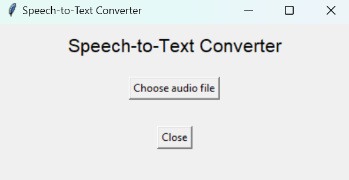
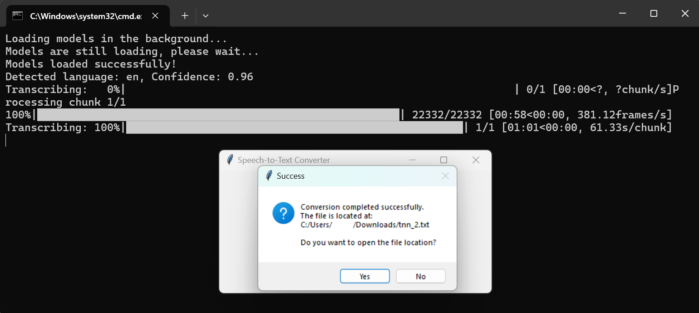

# Speech-to-Text Converter

## Description

**Speech-to-Text Converter** is a Python-based tool that converts speech from MP3 audio files into text using OpenAI's Whisper model. It provides highly accurate transcriptions for multiple languages. The user-friendly graphical interface is built using `Tkinter`, allowing seamless file selection and processing. This tool is designed to handle large audio files by breaking them into chunks, processing them in the background without freezing the interface, and delivering the final transcription as a text file.

---

## Features

- **Speech-to-Text Transcription**: Converts MP3 audio files into text using OpenAI's Whisper model. The tool supports multiple languages and efficiently handles large audio files.
- **Simple GUI**: Built using `Tkinter`, the graphical interface makes it easy to select files and start transcription.
- **Background Processing**: The tool loads Whisper models in the background and splits large audio files into smaller chunks to process them without freezing the interface.
- **Open File Location**: After transcription, the tool notifies the user and opens the location of the generated text file.
- **Progress Feedback**: Uses `TQDM` to provide a progress bar during transcription, giving feedback to the user on the chunk processing status.

---

## Project Structure

```
SpeechToTextConverter/
│
├── helpers/
│   ├── speech_to_text.py     # Speech-to-text transcription logic using Whisper
│   └── utils.py              # Utility functions (e.g., success message, open file location)
├── screenshots               # Folder containing screenshots for the README.md
├── LICENSE                   # License information for the project
├── README.md                 # Project documentation (this file)
├── main.py                   # Main script for running the GUI application
└── requirements.txt          # List of dependencies
```

---

## Requirements

To run this project, you will need:

- **Python 3.7 or higher**
- Libraries:
  - `torch==2.3.0+cu118`
  - `whisper==20231117`
  - `tqdm==4.66.4`
  - `numpy==1.26.4`
  - `pydub==0.25.1`
  - `mutagen==1.47.0`

### Installing Dependencies

To install the required libraries, use the `requirements.txt` file:

```bash
pip install -r requirements.txt
```

Alternatively, you can install them manually:

```bash
pip install torch==2.3.0+cu118 whisper tqdm numpy pydub mutagen
```

---

## Installation and Setup

### 1. Clone the Repository

```bash
git clone https://github.com/Glooring/speech-to-text-converter.git
cd speech-to-text-converter
```

### 2. Install Dependencies

Use the `requirements.txt` file to install the necessary Python libraries:

```bash
pip install -r requirements.txt
```

### 3. Run the Application

Once you’ve installed the required libraries, you can run the application:

```bash
python main.py
```

This will launch the GUI, and you can start interacting with the Speech-to-Text functionality.

---

## Usage

### Speech-to-Text Conversion:

1. **Choose an audio file**: 
    - Click the **"Choose audio file"** button in the GUI.
    - A file dialog will appear, allowing you to select an MP3 file from your local computer.

2. **Transcription**:
    - Once you've selected an MP3 file, the tool will start processing the audio and transcribing the speech into a `.txt` file. The Whisper model will automatically detect the language of the audio.
    - If the audio file is large, it will be split into smaller chunks for efficient processing.

3. **Notification**:
    - When transcription is complete, the tool will notify you with a success message. You can choose to open the folder where the `.txt` file is saved.

- **Screenshot Example**:
  

4. **Opening the File Location**:
    - After the transcription finishes, the tool will offer to open the folder where the transcript was saved.

- **Screenshot Example (Notification)**:
  

---

## How It Works

The Speech-to-Text Converter leverages OpenAI’s Whisper model to transcribe MP3 files into text. Here’s a step-by-step breakdown of the process:

1. **Model Loading**:
   When the tool is launched, it loads the Whisper models (for language detection and transcription) in the background. This ensures that the GUI remains responsive during initialization.

   **Terminal log**:
   ```
   Loading models in the background...
   ```

2. **Choosing an MP3 File**:
   After the models are loaded, the user selects an MP3 file for transcription. The tool detects the language of the audio file and prepares to process it.

   **Terminal log**:
   ```
   Models loaded successfully!
   ```

3. **Language Detection**:
   The Whisper model first analyzes the audio to detect its language. This is done using the `detect_language` function, which loads the audio file, processes it, and outputs the detected language along with the confidence level.

   **Example Terminal log**:
   ```
   Detected language: en, Confidence: 0.96
   ```

4. **Splitting Large Audio Files**:
   If the MP3 file is large (over 10 minutes), the tool splits it into chunks of 10 minutes each. This chunking ensures that even large audio files are processed efficiently without overwhelming the system.

5. **Transcription of Chunks**:
   Each chunk is processed separately by the Whisper model. The `TQDM` library provides a progress bar, giving feedback on the chunk processing status.

   **Example Terminal log**:
   ```
   Transcribing:   0%|                             | 0/1 [00:00<?, ?chunk/s]
   Processing chunk 1/1
   ```

6. **Progress Monitoring**:
   As the transcription proceeds, the progress is displayed in the terminal. The tool will show how many chunks have been processed and how long it takes to process each one.

   **Example Terminal log**:
   ```
   100%|█████████████████████████████████████████████████████████| 22332/22332 [00:58<00:00, 381.12frames/s]
   Transcribing: 100%|█████████████████████████████████████████████████████| 1/1 [01:01<00:00, 61.33s/chunk]
   ```

7. **Final Transcription**:
   After all chunks are processed, the tool combines the text from each chunk into one final transcript, which is saved as a `.txt` file.

   **Notification to User**:
   The tool notifies the user with a message indicating that transcription has been successfully completed, and the file location is opened.

---

## Technologies Used

This project leverages the following technologies:

- **Python**: Core language for scripting the tool.
- **Tkinter**: Provides the graphical user interface (GUI).
- **Whisper by OpenAI**: Used for speech-to-text transcription.
- **Torch**: Required for running the Whisper model efficiently.
- **Pydub**: Handles audio file manipulation, allowing the tool to split large audio files into smaller chunks.
- **TQDM**: Provides a progress bar during transcription to track the progress of chunk processing.
- **Mutagen**: Reads metadata from MP3 files, aiding in audio file processing.

---

## License

This project is licensed under the MIT License. See the [LICENSE](LICENSE) file for more details.

---

## Contributing

Contributions are welcome! If you’d like to contribute:

1. Fork the repository.
2. Create a new branch (`git checkout -b feature-branch`).
3. Make your changes.
4. Commit your changes (`git commit -m "Added new feature"`).
5. Push the branch (`git push origin feature-branch`).
6. Open a pull request.

For major changes, open an issue first to discuss your proposed changes.

---

## Future Improvements

- **Support for Additional Formats**: Add support for other audio formats like WAV or OGG.
- **Model Selection**: Allow users to select different Whisper model sizes depending on their hardware capabilities.
- **Manual Language Selection**: Provide an option for users to manually select the language for transcription.

---

## Acknowledgements

- **OpenAI** for developing the Whisper model, which powers the speech-to-text transcription.
- The **open-source community** for the libraries and tools that made this project possible.
- **Contributors** who helped improve and maintain this project.

---

## Notes on Deployment

- **Performance**: The Whisper model can utilize GPUs (via CUDA) to speed up transcription for large files. Make sure to have CUDA installed if you have a compatible GPU for faster performance.
- **Security**: Ensure that any sensitive data, such as API keys or user data, is handled securely and not exposed in the repository.